# Hi Welcome to the Documentation of i-Lib - Library Management System of RKMVCC

* [For Mobile User (Student)](#for-mobile-user-student)
* [For Mobile User (Admin)](#for-mobile-user-admin)
* [For Linux User (All)](#for-linux-user-all)
* [For Windows User (All)](#for-windows-user-all)

### For Mobile User (Student)

#### **Step 1**:

[Click Here](https://ilib.website) Or scan the QR code below with your mobile device with an active Internet connection.


#### **Step 2**:

Click on the three dots on your browser and press **Install app** button on the menu as shown below.


#### **Step 3**:

Click on the **Install** button and wait for the installation process to finish.


#### **Step 4**:

An app as above with name **iLib** will shown on your home screen.


#### **Step 5**:

Open the app, and go to the login section.


#### **Step 6**:

If you don't have an account on iLib, Press on the **Register for a new account** button.


#### **Step 7**:

Enter the proper details as required and upload a passport size photo or selfie of your own wearing the college uniform. **The photo size must be less than *350* kb**. The details will be checked before making you a premium user, so enter it carefully.


#### **Step 8**:

You will receive an e-mail with a verification link. Verify your email with it.


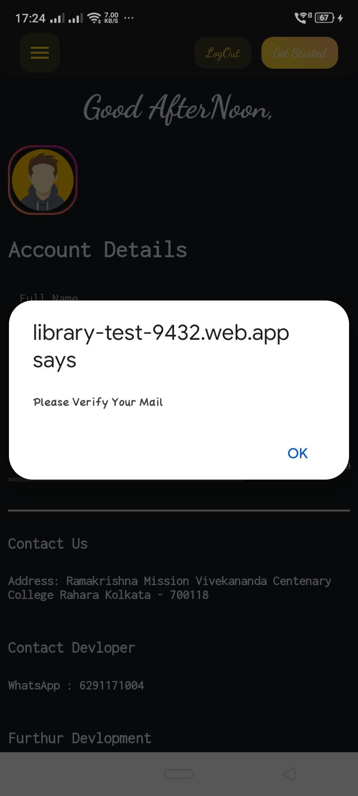

#### **Step 9**:

After clicking the link in the e-mail, your verfifcation status will be updated.


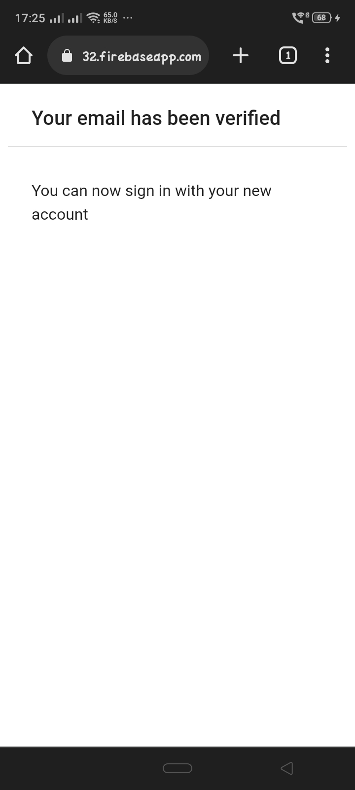

#### **Step 10:**

Logout from the application and login once again.


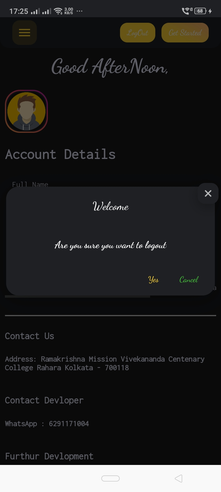

#### **Step 11:**

Go to library admin and ask him to update your premium status so that you will be able to request for books.


After updating the premium status, your 'Account Details' window will look like this.


#### **Step 12:**

Search and request for a book in the request window. You can borrow maximum of 2 books at a time. The books should be returned between 15 days.


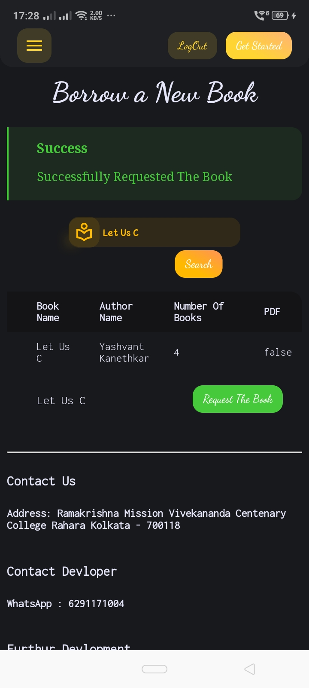

#### **Step 13:**

For Returning a book you must go to library and ask admin to approve your return request.

### For Mobile User (Admin)

#### **Step 1:**

Step 1-10 are same as student user. You can go through it.

#### **Step 2:**

Asks the developer to make yourself admin.

#### **Making student premium:**

Go to student details section.


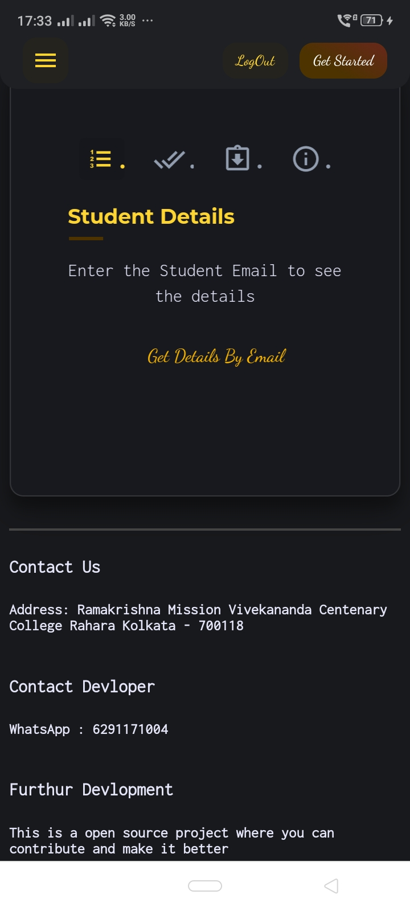

Click on the **Get details by email** button and enter the student email and search.


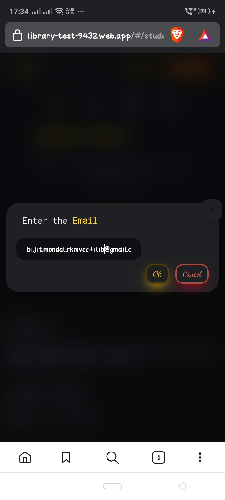

Approve as premium user or delete the user.


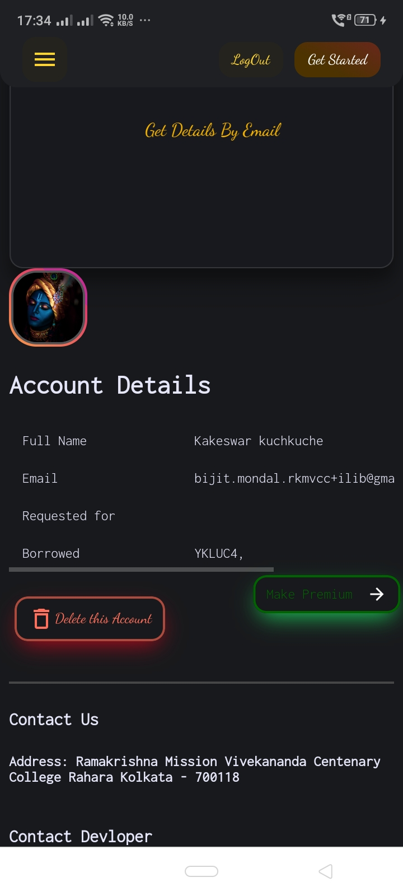

#### **Approve Pending Request**

Click on the **Load Pending Request** button and approve or decline student's borrow request.


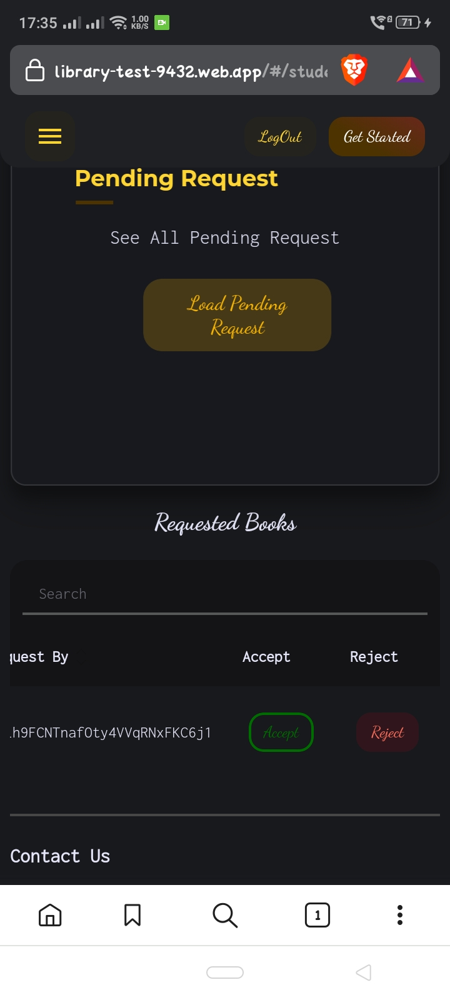

#### **Approve Return Request**

Click on the  **Load Return Request** button and approve return request. **If the user is late to return the book, fine charges button will glow**


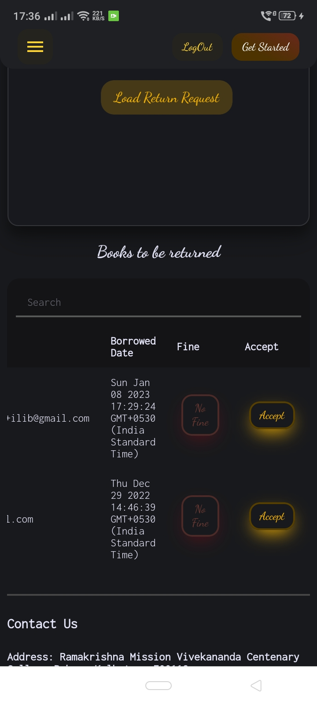

#### **Add a new book**

Click on the **Add a new book** button from menu and enter the details of the book, make sure each book has a ***unique*** ISBN number.


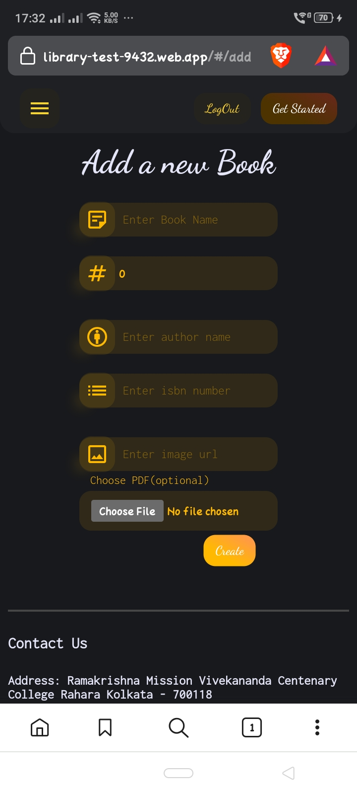

#### **The image URL part**

Search for the book's front page image online and paste the link in the input area.


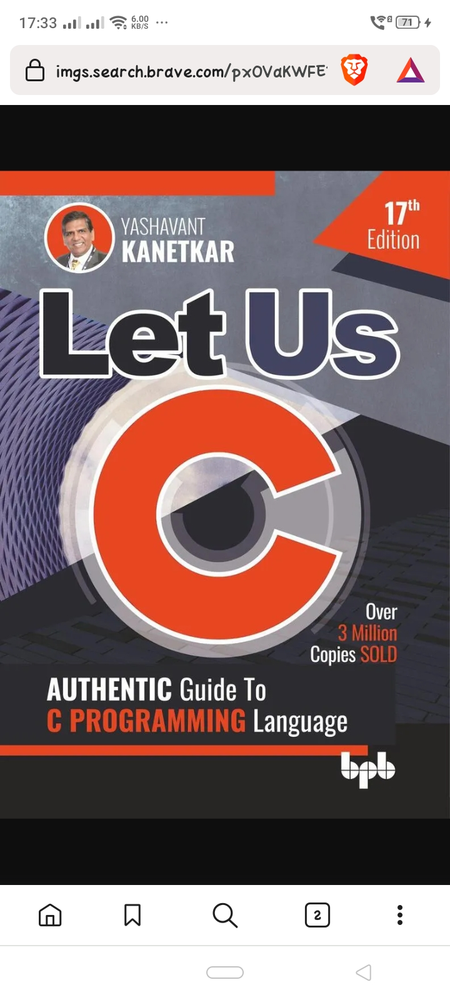

#### **Upload book's pdf**

You can upload a book's pdf but then make sure the pdf is less than 1 MB in size.

> Enter the details of book properly for no furthur issue. And once again make sure each book has unique ISBN number and don't repeat a book twice.

### For Linux User (All)

#### **Step 1: Download**

> Ubuntu, Debian

First you need to download snap package manager on the machine.

```
$ sudo apt update
$ sudo apt install snapd
```

[Download the file](https://github.com/Bijit-Mondal/iLib-Documentation/releases)

Go to the downloaded directory and open terminal.

```
$ sudo snap install iLib_0.1.0_amd64.snap --dangerous
```

```
$ ilib
```

> Arch Linux

First you need to download snap package manager on the machine

```
$ git clone https://aur.archlinux.org/yay

$ cd yay

$ makepkg -si
$ yay -Sy snapd
```

[Download the file](https://github.com/Bijit-Mondal/iLib-Documentation/releases)
Go to the downloaded directory and open terminal.

```
$ sudo snap install iLib_0.1.0_amd64.snap --dangerous
```

```
$ ilib
```

#### **Step 2:**

Other steps are same as above.

### For Windows User (All)

#### ~~Step 1~~:

Sorry windows users, I haven't developed iLib for windows, nor do I want to. If you really want desktop like experience on windows download the Web App :)
