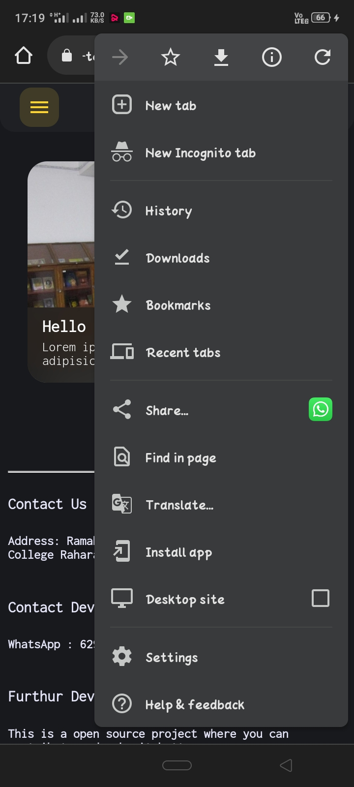
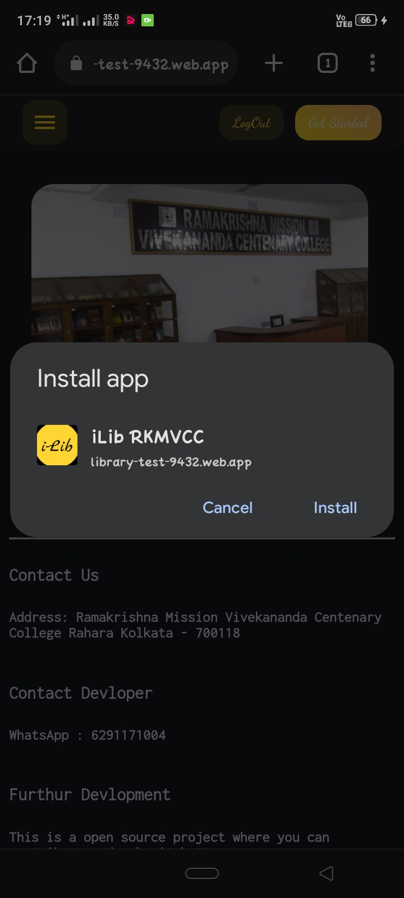
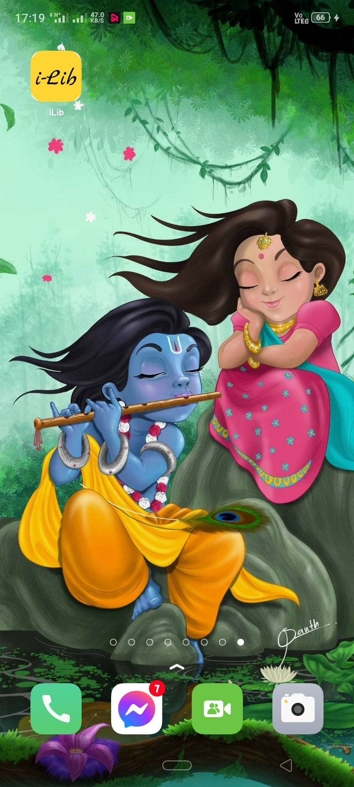
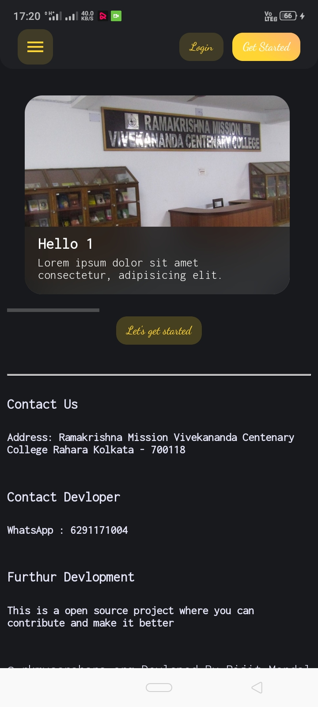
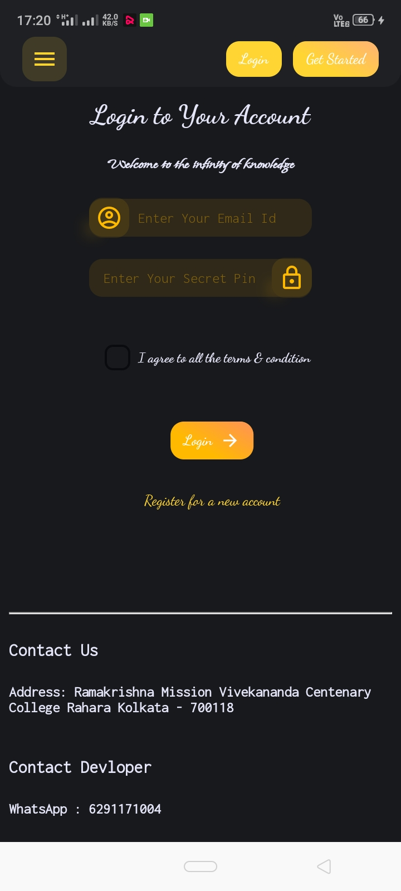
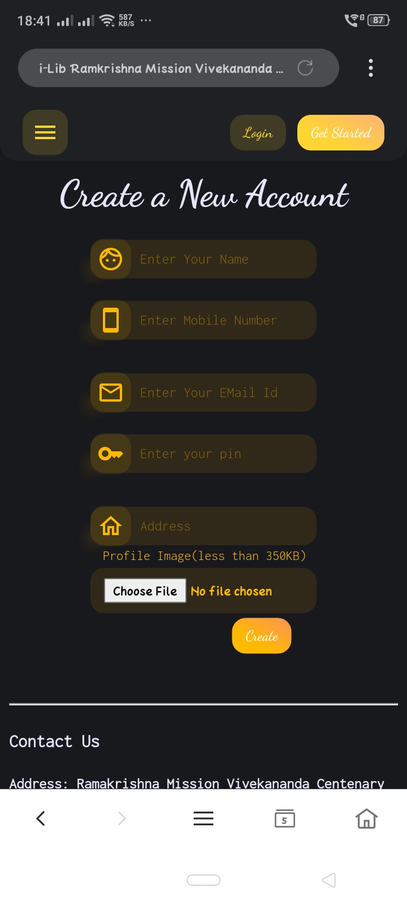

# Hi Welcome to the Documentation of i-Lib - Library Management System of RKMVCC

* [For Mobile User (Student)](#mobile_student)
* For Mobile User (Admin)
* For Linux User (Student/Admin)
* For Windows User (Student/Admin)

### For Mobile User (Student)

#### **Step 1**:

[Click Here](https://library-test-9432.web.app) Or scan the below image with your mobile device with active internet connection

#### **Step 2**:

Click on the three dots on your browser and press **Install app** button on the menu as shown below.

#### **Step 3**:

Click on the **Install** button and wait for it to finish

#### **Step 4**:

An app as above with name **iLib** will shown on home wallpaper

#### **Step 5**:

Open the app, and go to login section

#### **Step 6**:

If you don't have account on iLib, Press on the **Register for a new account** button.

#### **Step 7**:

Enter the proper details as reqquired and upload a passport size photo or selfie of your own wearing college uniform. **The photo size must be less than *350* kb**. The details will be check before making you a premium user, so enter it carefully

#### **Step 8**:
